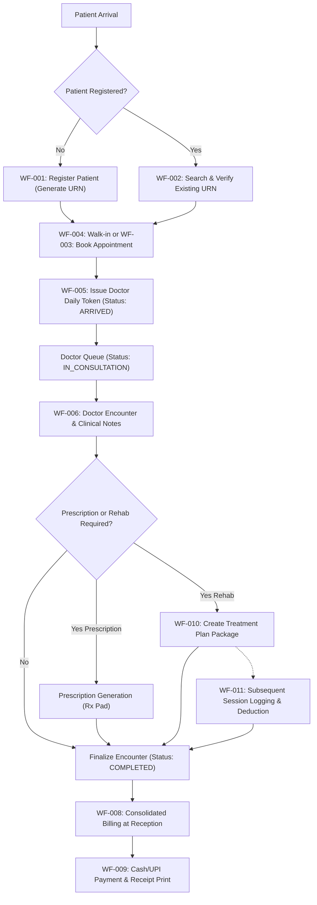

# Kalyan Hospital — Process Dependency Map

## Complete Patient & Clinical Journey

```mermaid
flowchart TD
    A["Patient Arrival"] --> B{"Patient Registered?"}
    B -- No --> C["WF-001: Register Patient (Generate URN)"]
    B -- Yes --> D["WF-002: Search & Verify Existing URN"]
    
    C --> E["WF-004: Walk-in or WF-003: Book Appointment"]
    D --> E
    
    E --> F["WF-005: Issue Doctor Daily Token (Status: ARRIVED)"]
    F --> G["Doctor Queue (Status: IN_CONSULTATION)"]
    
    G --> H["WF-006: Doctor Encounter & Clinical Notes"]
    H --> I{"Prescription or Rehab Required?"}
    
    I -- Yes Prescription --> J["Prescription Generation (Rx Pad)"]
    I -- Yes Rehab --> K["WF-010: Create Treatment Plan Package"]
    I -- No --> L["Finalize Encounter (Status: COMPLETED)"]
    
    J --> L
    K --> L
    
    L --> M["WF-008: Consolidated Billing at Reception"]
    M --> N["WF-009: Cash/UPI Payment & Receipt Print"]
    
    K -.-> O["WF-011: Subsequent Session Logging & Deduction"]
    O --> L
```

