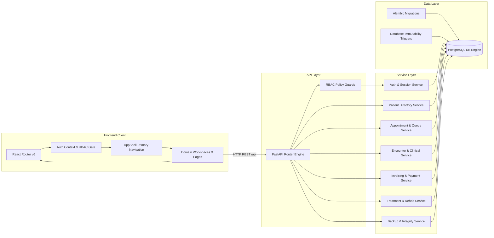

# Kalyan Hospital — System Dependency Graph

```mermaid
graph LR
    subgraph Data Layer
        DB[("PostgreSQL DB Engine")]
        Migrate["Alembic Migrations"]
        Triggers["Database Immutability Triggers"]
    end

    subgraph Service Layer
        AuthSvc["Auth & Session Service"]
        PatientSvc["Patient Directory Service"]
        ApptSvc["Appointment & Queue Service"]
        EncounterSvc["Encounter & Clinical Service"]
        BillingSvc["Invoicing & Payment Service"]
        TreatmentSvc["Treatment & Rehab Service"]
        BackupSvc["Backup & Integrity Service"]
    end

    subgraph API Layer
        FastAPIApp["FastAPI Router Engine"]
        RBAC["RBAC Policy Guards"]
    end

    subgraph Frontend Client
        Router["React Router v6"]
        AuthContext["Auth Context & RBAC Gate"]
        AppShell["AppShell Primary Navigation"]
        Views["Domain Workspaces & Pages"]
    end

    Migrate --> DB
    Triggers --> DB
    AuthSvc --> DB
    PatientSvc --> DB
    ApptSvc --> DB
    EncounterSvc --> DB
    BillingSvc --> DB
    TreatmentSvc --> DB
    BackupSvc --> DB

    RBAC --> AuthSvc
    FastAPIApp --> RBAC
    FastAPIApp --> PatientSvc
    FastAPIApp --> ApptSvc
    FastAPIApp --> EncounterSvc
    FastAPIApp --> BillingSvc
    FastAPIApp --> TreatmentSvc
    FastAPIApp --> BackupSvc

    Views --> Router
    Router --> AuthContext
    AuthContext --> AppShell
    AppShell --> Views
    Views -->|HTTP REST /api| FastAPIApp
```

